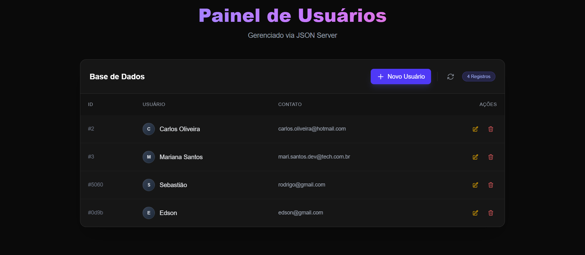
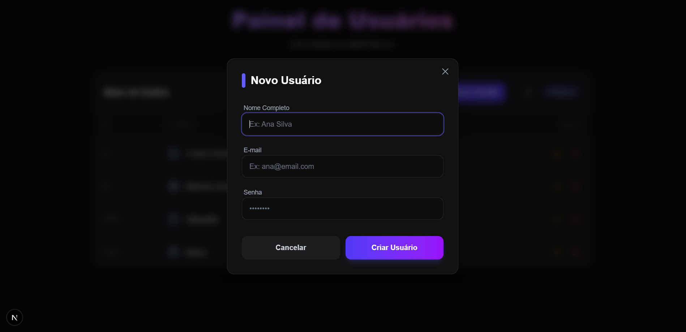

# 🚀 Painel de Gerenciamento de Usuários

<div align="center">


**Sistema moderno de CRUD para gerenciamento de usuários com interface premium e validações robustas**

### ✨ Tela Home ✨



<br />

### ✨ Tela Modal ✨



<br />
<br />

[Características](#-características) • [Instalação](#-instalação) • [Uso](#-uso) • [Tecnologias](#-tecnologias) • [API](#-api) • [Estrutura](#-estrutura-do-projeto)

</div>

---

## 📋 Sobre o Projeto

Este é um **sistema completo de gerenciamento de usuários** desenvolvido com as tecnologias mais modernas do ecossistema React. O projeto oferece uma interface elegante e intuitiva para realizar operações CRUD (Create, Read, Update, Delete) em uma base de dados de usuários, utilizando JSON Server como backend simulado.

### ✨ Características

#### 🎨 Interface Premium
- **Design Moderno**: Interface dark mode com gradientes vibrantes e glassmorphism
- **Animações Suaves**: Transições e micro-animações para melhor experiência do usuário
- **Responsivo**: Layout adaptável para desktop, tablet e mobile
- **Feedback Visual**: Indicadores de estado (loading, success, error) em todas as operações

#### 🔐 Validação Robusta
- **Validação em Tempo Real**: Feedback instantâneo durante o preenchimento de formulários
- **Schema Validation**: Validação de dados com Zod
- **React Hook Form**: Gerenciamento eficiente de formulários
- **Mensagens Personalizadas**: Erros claros e em português.

#### 🛠️ Funcionalidades
- ✅ **Criar** novos usuários com validação completa
- ✅ **Listar** todos os usuários cadastrados
- ✅ **Editar** informações de usuários existentes
- ✅ **Excluir** usuários com modal de confirmação
- ✅ **Atualizar** lista em tempo real
- ✅ **Persistência** de dados via JSON Server API

#### 🎯 Experiência do Usuário
- **Modais Inteligentes**: Para criação, edição e exclusão
- **Confirmação de Exclusão**: Previne deleções acidentais
- **Estados de Loading**: Feedback visual durante operações assíncronas
- **Ícones SVG**: Interface visual rica e profissional
- **Contador de Registros**: Visualização rápida do total de usuários

---

## 🚀 Instalação

### Pré-requisitos

Certifique-se de ter instalado em sua máquina:

- **Node.js** (versão 18 ou superior) - [Download](https://nodejs.org/)
- **npm** ou **yarn** (gerenciador de pacotes)
- **Git** (opcional, para clonar o repositório)

### Passo a Passo

#### 1️⃣ Clone ou baixe o projeto

```bash
# Se estiver usando Git
git clone <url-do-repositorio>
cd app1

# Ou simplesmente navegue até a pasta do projeto
cd c:\html-impressionador\app1
```

#### 2️⃣ Instale as dependências

```bash
npm install
```

Isso instalará todas as dependências necessárias:
- Next.js 16.0.3
- React 19.2.0
- TypeScript 5
- Tailwind CSS 4
- React Hook Form 7.66.1
- Zod 4.1.12
- JSON Server 1.0.0-beta.3
- E outras dependências de desenvolvimento

#### 3️⃣ Configure o banco de dados

O arquivo `banco.json` já está configurado na raiz do projeto. Estrutura padrão:

```json
{
  "usuarios": [
    {
      "nome": "Nome do Usuário",
      "email": "email@exemplo.com",
      "senha": "senha123",
      "id": "1"
    }
  ]
}
```

> **Nota**: O JSON Server gera IDs automaticamente ao criar novos usuários.

---

## 💻 Uso

### Iniciando o Projeto

Para executar o projeto, você precisa iniciar **DOIS servidores** simultaneamente:

#### Terminal 1: JSON Server (Backend/API)

```bash
npm run api
```

Isso iniciará o JSON Server na porta **3001**:
- 🌐 API disponível em: `http://localhost:3001`
- 📊 Endpoint de usuários: `http://localhost:3001/usuarios`

**Saída esperada:**
```
JSON Server started on PORT :3001
Press CTRL-C to stop
Watching banco.json...
```

#### Terminal 2: Next.js (Frontend)

```bash
npm run dev
```

Isso iniciará o servidor de desenvolvimento Next.js na porta **3000**:
- 🌐 Aplicação disponível em: `http://localhost:3000`

**Saída esperada:**
```
  ▲ Next.js 16.0.3
  - Local:        http://localhost:3000
  - Ready in 2.3s
```

### Acessando a Aplicação

1. Abra seu navegador
2. Acesse: **http://localhost:3000**
3. Você verá o **Painel de Usuários** com a interface completa

---

## 🎮 Funcionalidades Detalhadas

### 1. Criar Novo Usuário

1. Clique no botão **"Novo Usuário"** (azul com ícone +)
2. Preencha o formulário modal:
   - **Nome Completo**: Mínimo 1 caractere
   - **E-mail**: Formato válido de e-mail
   - **Senha**: Mínimo 3 caracteres
3. Clique em **"Criar Usuário"**
4. O usuário será adicionado à lista automaticamente

**Validações:**
- ❌ Nome vazio → "O nome é obrigatório"
- ❌ E-mail inválido → "Formato de e-mail inválido"
- ❌ Senha curta → "A senha deve ter no mínimo 3 caracteres"

### 2. Editar Usuário

1. Clique no ícone de **lápis** (amarelo) na linha do usuário
2. O modal de edição abrirá com os dados preenchidos
3. Modifique os campos desejados
4. Clique em **"Salvar Alterações"**
5. As mudanças serão refletidas imediatamente

**Indicador visual:** A linha do usuário sendo editado fica destacada em amarelo.

### 3. Excluir Usuário

1. Clique no ícone de **lixeira** (vermelho) na linha do usuário
2. Um modal de confirmação aparecerá mostrando o nome do usuário
3. Clique em **"Sim, Excluir"** para confirmar ou **"Cancelar"** para desistir
4. O usuário será removido da lista

**Segurança:** Modal de confirmação previne exclusões acidentais.

### 4. Atualizar Lista

1. Clique no ícone de **atualização** (circular) no cabeçalho
2. A lista será recarregada do servidor
3. Útil para sincronizar dados se múltiplos usuários estiverem acessando

### 5. Visualizar Contador

- O badge **"X Registros"** mostra o total de usuários cadastrados
- Atualiza automaticamente após cada operação

---

## 🛠️ Tecnologias

### Frontend

| Tecnologia | Versão | Descrição |
|------------|--------|-----------|
| **Next.js** | 16.0.3 | Framework React com SSR e App Router |
| **React** | 19.2.0 | Biblioteca para construção de interfaces |
| **TypeScript** | 5.0 | Superset JavaScript com tipagem estática |
| **Tailwind CSS** | 4.0 | Framework CSS utility-first |
| **React Hook Form** | 7.66.1 | Gerenciamento de formulários performático |
| **Zod** | 4.1.12 | Validação de schemas TypeScript-first |
| **@hookform/resolvers** | 5.2.2 | Integração Zod + React Hook Form |

### Backend/API

| Tecnologia | Versão | Descrição |
|------------|--------|-----------|
| **JSON Server** | 1.0.0-beta.3 | API REST fake para prototipagem rápida |

### Ferramentas de Desenvolvimento

| Ferramenta | Versão | Descrição |
|------------|--------|-----------|
| **ESLint** | 9.0 | Linter para identificar problemas no código |
| **PostCSS** | - | Processador CSS para Tailwind |
| **@tailwindcss/postcss** | 4.0 | Plugin PostCSS do Tailwind CSS |

---

## 📡 API

O JSON Server expõe automaticamente uma API RESTful completa:

### Endpoints Disponíveis

#### 📋 Listar Todos os Usuários
```http
GET http://localhost:3001/usuarios
```

**Resposta (200 OK):**
```json
[
  {
    "id": "1",
    "nome": "João Silva",
    "email": "joao@email.com",
    "senha": "senha123"
  }
]
```

#### 👤 Buscar Usuário por ID
```http
GET http://localhost:3001/usuarios/:id
```

**Exemplo:**
```http
GET http://localhost:3001/usuarios/1
```

#### ➕ Criar Novo Usuário
```http
POST http://localhost:3001/usuarios
Content-Type: application/json

{
  "nome": "Maria Santos",
  "email": "maria@email.com",
  "senha": "senha456"
}
```

**Resposta (201 Created):**
```json
{
  "id": "2",
  "nome": "Maria Santos",
  "email": "maria@email.com",
  "senha": "senha456"
}
```

#### ✏️ Atualizar Usuário
```http
PUT http://localhost:3001/usuarios/:id
Content-Type: application/json

{
  "nome": "Maria Santos Silva",
  "email": "maria.silva@email.com",
  "senha": "novaSenha789"
}
```

#### 🗑️ Deletar Usuário
```http
DELETE http://localhost:3001/usuarios/:id
```

**Resposta (200 OK):**
```json
{}
```

### Recursos Avançados do JSON Server

#### Filtros
```http
GET http://localhost:3001/usuarios?nome=João
GET http://localhost:3001/usuarios?email_like=@gmail.com
```

#### Paginação
```http
GET http://localhost:3001/usuarios?_page=1&_limit=10
```

#### Ordenação
```http
GET http://localhost:3001/usuarios?_sort=nome&_order=asc
```

---

## 📁 Estrutura do Projeto

```
app1/
├── 📂 app/                          # Diretório principal do Next.js (App Router)
│   ├── 📂 components/               # Componentes React reutilizáveis
│   │   └── UserManagement.tsx       # Componente principal de gerenciamento
│   ├── 📂 types/                    # Definições de tipos TypeScript
│   │   └── user.ts                  # Interface User
│   ├── favicon.ico                  # Ícone da aplicação
│   ├── globals.css                  # Estilos globais e Tailwind
│   ├── layout.tsx                   # Layout raiz da aplicação
│   └── page.tsx                     # Página inicial (Home)
│
├── 📂 public/                       # Arquivos estáticos públicos
│
├── 📂 node_modules/                 # Dependências do projeto (gerado)
│
├── 📂 .next/                        # Build do Next.js (gerado)
│
├── 📄 banco.json                    # Banco de dados JSON Server
├── 📄 package.json                  # Dependências e scripts
├── 📄 package-lock.json             # Lock de versões das dependências
├── 📄 tsconfig.json                 # Configuração TypeScript
├── 📄 next.config.ts                # Configuração Next.js
├── 📄 postcss.config.mjs            # Configuração PostCSS
├── 📄 eslint.config.mjs             # Configuração ESLint
├── 📄 next-env.d.ts                 # Tipos Next.js (gerado)
├── 📄 .gitignore                    # Arquivos ignorados pelo Git
└── 📄 README.md                     # Este arquivo
```

### Arquivos Principais

#### `app/components/UserManagement.tsx`
Componente principal contendo:
- **DeleteUserModal**: Modal de confirmação de exclusão
- **UserFormModal**: Modal de criação/edição de usuários
- **UserTable**: Tabela de listagem de usuários
- **UserListHeader**: Cabeçalho com ações e contador
- **FormField**: Componente reutilizável de campo de formulário
- **Ícones SVG**: Componentes de ícones (Trash, Edit, Close, Plus, Refresh)

#### `app/types/user.ts`
```typescript
export interface User {
  id?: string | number;
  nome: string;
  email: string;
  senha?: string;
}
```

#### `app/page.tsx`
- Página principal que busca usuários do servidor
- Renderiza o componente `UserManagement`
- Implementa Server Component do Next.js

#### `banco.json`
```json
{
  "usuarios": []
}
```

---

## 🎨 Customização

### Cores e Tema

As cores principais estão definidas no Tailwind CSS. Para customizar:

**Gradientes principais:**
- **Criar**: `from-indigo-600 to-purple-600`
- **Editar**: `from-amber-600 to-orange-600`
- **Excluir**: `bg-red-600`

**Background:**
- Fundo principal: `bg-[#0a0a0a]`
- Cards: `bg-white/5` com `backdrop-blur-xl`

### Validações

Para modificar as regras de validação, edite o schema Zod em `UserManagement.tsx`:

```typescript
const userSchema = z.object({
    nome: z.string().min(1, 'O nome é obrigatório'),
    email: z.string().email('Formato de e-mail inválido'),
    senha: z.string().min(3, 'A senha deve ter no mínimo 3 caracteres'),
});
```

**Exemplos de customização:**
```typescript
// Senha mais forte
senha: z.string()
  .min(8, 'Mínimo 8 caracteres')
  .regex(/[A-Z]/, 'Deve conter maiúscula')
  .regex(/[0-9]/, 'Deve conter número'),

// Nome com limite máximo
nome: z.string()
  .min(3, 'Mínimo 3 caracteres')
  .max(50, 'Máximo 50 caracteres'),

// E-mail de domínio específico
email: z.string()
  .email('E-mail inválido')
  .endsWith('@empresa.com', 'Use e-mail corporativo'),
```

### Porta da API

Para alterar a porta do JSON Server, edite `package.json`:

```json
"scripts": {
  "api": "json-server --watch banco.json --port 3001"
}
```

E atualize as URLs de fetch em `UserManagement.tsx` e `page.tsx`.

---

## 🐛 Troubleshooting

### Problema: "Failed to fetch" ou erro de conexão

**Causa:** JSON Server não está rodando.

**Solução:**
```bash
# Certifique-se de que o JSON Server está ativo
npm run api
```

### Problema: Porta 3000 ou 3001 já em uso

**Solução para porta 3000 (Next.js):**
```bash
# Use uma porta diferente
npx next dev -p 3002
```

**Solução para porta 3001 (JSON Server):**
```bash
# Altere no package.json
"api": "json-server --watch banco.json --port 3002"
```

### Problema: Mudanças no código não aparecem

**Solução:**
```bash
# Pare o servidor (Ctrl+C) e reinicie
npm run dev
```

### Problema: Erro de TypeScript

**Solução:**
```bash
# Limpe o cache do Next.js
rm -rf .next
npm run dev
```

### Problema: Dependências não instaladas

**Solução:**
```bash
# Reinstale as dependências
rm -rf node_modules package-lock.json
npm install
```

---

## 📚 Scripts Disponíveis

| Script | Comando | Descrição |
|--------|---------|-----------|
| **Desenvolvimento** | `npm run dev` | Inicia servidor Next.js em modo desenvolvimento |
| **Build** | `npm run build` | Cria build de produção otimizado |
| **Start** | `npm run start` | Inicia servidor de produção (após build) |
| **Lint** | `npm run lint` | Executa ESLint para verificar código |
| **API** | `npm run api` | Inicia JSON Server na porta 3001 |

### Fluxo de Desenvolvimento

```bash
# 1. Instalar dependências (apenas primeira vez)
npm install

# 2. Iniciar API (Terminal 1)
npm run api

# 3. Iniciar aplicação (Terminal 2)
npm run dev

# 4. Acessar no navegador
# http://localhost:3000
```

### Fluxo de Produção

```bash
# 1. Criar build otimizado
npm run build

# 2. Iniciar servidor de produção
npm run start

# 3. API continua necessária
npm run api
```

---

## 🔒 Segurança

> **⚠️ IMPORTANTE**: Este projeto é para fins educacionais e de demonstração.

### Considerações de Segurança

1. **Senhas em Texto Plano**: 
   - ❌ Atualmente as senhas são armazenadas sem criptografia
   - ✅ Em produção, use bcrypt ou argon2 para hash de senhas

2. **Sem Autenticação**:
   - ❌ Não há sistema de login/autenticação
   - ✅ Implemente JWT ou NextAuth.js para produção

3. **CORS Aberto**:
   - ❌ JSON Server aceita requisições de qualquer origem
   - ✅ Configure CORS adequadamente em produção

4. **Validação Client-Side**:
   - ❌ Validação apenas no frontend
   - ✅ Sempre valide dados no backend também

### Melhorias Recomendadas para Produção

```typescript
// Exemplo: Hash de senha com bcrypt
import bcrypt from 'bcrypt';

const hashedPassword = await bcrypt.hash(password, 10);
const isValid = await bcrypt.compare(password, hashedPassword);
```

---

## 🚀 Próximos Passos

### Melhorias Sugeridas

- [ ] Implementar autenticação com NextAuth.js
- [ ] Adicionar paginação na tabela de usuários
- [ ] Implementar busca/filtro de usuários
- [ ] Adicionar upload de foto de perfil
- [ ] Criar dashboard com estatísticas
- [ ] Implementar testes unitários (Jest + React Testing Library)
- [ ] Adicionar testes E2E (Playwright ou Cypress)
- [ ] Migrar de JSON Server para banco real (PostgreSQL + Prisma)
- [ ] Implementar cache com React Query
- [ ] Adicionar internacionalização (i18n)
- [ ] Criar modo claro/escuro (theme toggle)
- [ ] Implementar exportação de dados (CSV/PDF)

---

## 📖 Recursos de Aprendizado

### Documentação Oficial

- [Next.js Documentation](https://nextjs.org/docs)
- [React Documentation](https://react.dev)
- [TypeScript Handbook](https://www.typescriptlang.org/docs/)
- [Tailwind CSS](https://tailwindcss.com/docs)
- [React Hook Form](https://react-hook-form.com/)
- [Zod](https://zod.dev/)
- [JSON Server](https://github.com/typicode/json-server)

### Tutoriais Relacionados

- [Next.js App Router Tutorial](https://nextjs.org/learn)
- [React Hook Form + Zod](https://react-hook-form.com/get-started#SchemaValidation)
- [Tailwind CSS Best Practices](https://tailwindcss.com/docs/reusing-styles)

---

## 🤝 Contribuindo

Contribuições são bem-vindas! Para contribuir:

1. Faça um fork do projeto
2. Crie uma branch para sua feature (`git checkout -b feature/MinhaFeature`)
3. Commit suas mudanças (`git commit -m 'Adiciona MinhaFeature'`)
4. Push para a branch (`git push origin feature/MinhaFeature`)
5. Abra um Pull Request

---

## 📝 Licença

Este projeto é de código aberto e está disponível para uso educacional e comercial.

---

## 👨‍💻 Autor

Desenvolvido com ❤️ usando as melhores práticas de desenvolvimento web moderno.

---

## 📞 Suporte

Se você encontrar algum problema ou tiver dúvidas:

1. Verifique a seção [Troubleshooting](#-troubleshooting)
2. Consulte a documentação das tecnologias utilizadas
3. Abra uma issue no repositório do projeto

---

<div align="center">

**⭐ Se este projeto foi útil, considere dar uma estrela!**

Feito com Next.js 16 • React 19 • TypeScript • Tailwind CSS

</div>